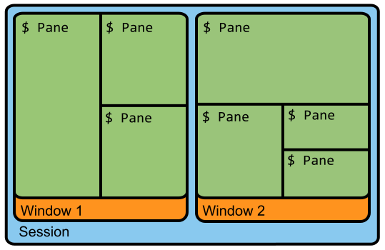

### 前言

日常的工作中，需要频繁的登陆堡垒机，登陆过程又比较复杂，tmux是我比较常用的终端工具，分享给大家使用

### Tmux简介

在服务端运行，强大的窗口管理和会话保持； 基于命令行，可定制多种插件；

### 会话(session)、窗口(window)、窗格(panel)的概念

>它们的从属关系：session -> window -> panel

主要概念分为三个

- session 默认开启tmux时，会建立一个session, 在这个会话中，会开启一个window, 可以创建多个session, 并且可随意切换
- window 一个session可管理多个window
- panel 用户可对window进行随意的切割，切割出的块就叫panel




### Tmux安装
mac安装
```
brew install tmux
```
CentOs安装
```
yum install tmux
```

#### Tmux简单配置

tmux的各种操作，都需要一个`<leader>`, 只有先按下`<leader>`后，各种快捷命令才会生效, 默认的组合键为`C-b`(ctrl+b).

tmux的配置大致分为:

- 配置各种快捷键映射，方便操作
- 修改系统提供的优化配置

tmux的配置文件为.tmux.conf，需要放置在当前登陆用户的家目录下:

- tmux kill-server 关闭tmux，重新进入
- 在会话中，`<leader>`: 进入命令模式，输入source-file ~/.tmux.conf，此方式，只是增量的执行配置文件中的命令

常用配置如下:

```
# 开启鼠标模式(特别不好用)
set -g mode-mouse on

# 允许鼠标选择窗格
set -g mouse-select-pane on

# 如果喜欢给窗口自定义命名，那么需要关闭窗口的自动命名
set-option -g allow-rename off

# 如果对 vim 比较熟悉，可以将 copy mode 的快捷键换成 vi 模式
set-window-option -g mode-keys vi
```

### Shell常用命令
- `tmux new -s foo`               # 新建名称为 foo 的会话
- `tmux ls`                       # 列出所有 tmux 会话
- `tmux a`                        # 恢复至上一次的会话
- `tmux a -t foo`                 # 恢复名称为 foo 的会话，会话默认名称为数字
- `tmux kill-session -t foo`      # 删除名称为 foo 的会话
- `tmux kill-server`              # 删除所有的会话

### 基础操作(leader)
- `?` 列出所有的快捷键

### Session会话操作(leader)
- `$` 重命名当前会话
- `s` 选择会话列表
- `d` detach 当前会话，运行后将会退出 tmux 进程，返回至 shell 主进程

### Window窗口操作(leader)
- `c` 新建窗口，此时当前窗口会切换至新窗口，不影响原有窗口的状态
- `p` 切换至上一窗口
- `n` 切换至下一窗口
- `w` 窗口列表选择，注意 macOS 下使用 ⌃p 和 ⌃n 进行上下选择
- `&` 关闭当前窗口
- `,` 重命名窗口，可以使用中文，重命名后能在 tmux 状态栏更快速的识别窗口 id
- `0` 切换至 0 号窗口，使用其他数字 id 切换至对应窗口
- `f` 根据窗口名搜索选择窗口，可模糊匹配

### Panel窗格操作(leader)
- `%` 左右平分出两个窗格
- `"` 上下平分出两个窗格
- `x` 关闭当前窗格
- `{` 当前窗格前移
- `}` 当前窗格后移
- `;` 选择上次使用的窗格
- `o` 选择下一个窗格，也可以使用上下左右方向键来选择
- `s`pace 切换窗格布局，tmux 内置了五种窗格布局，也可以通过 ⌥1 至 ⌥5来切换
- `z` 最大化当前窗格，再次执行可恢复原来大小
- `q` 显示所有窗格的序号，在序号出现期间按下对应的数字，即可跳转至对应的窗格
